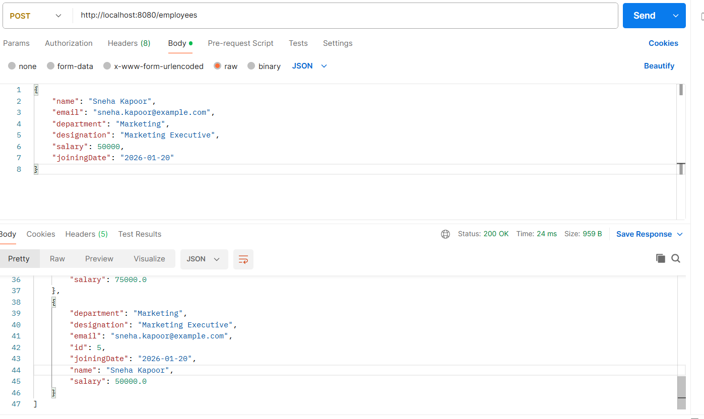
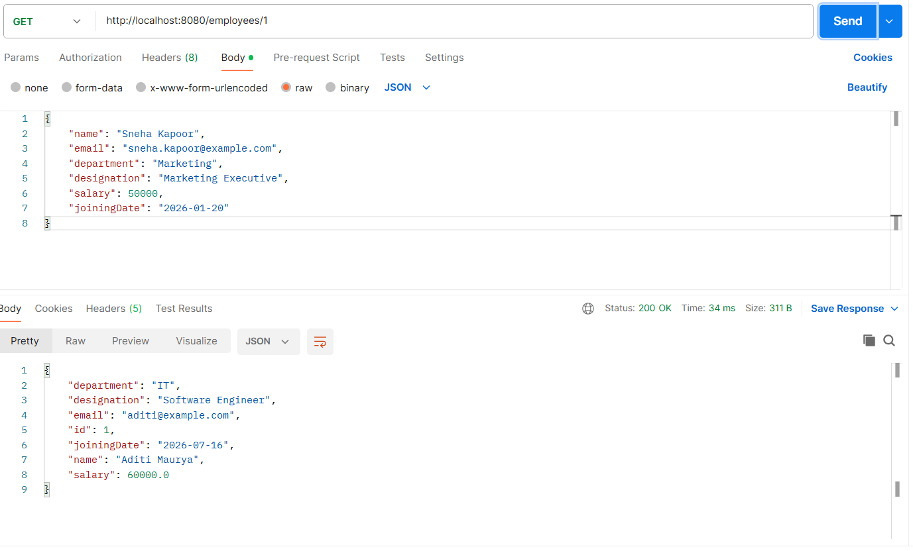
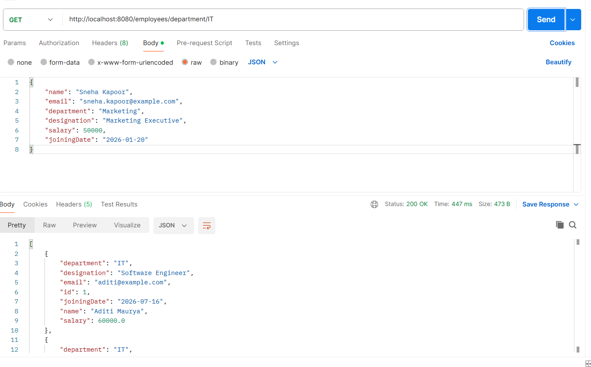
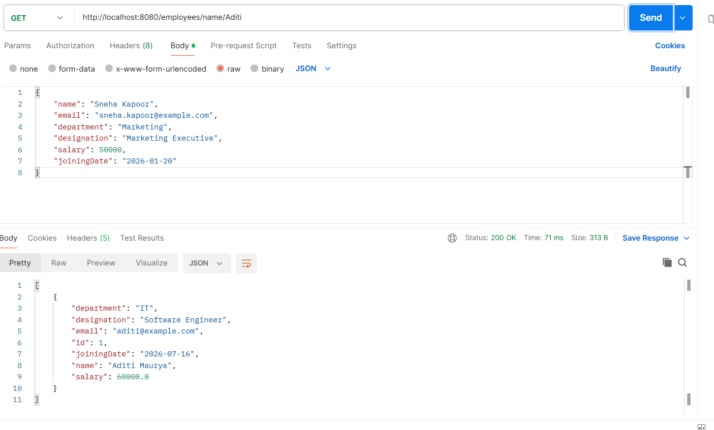
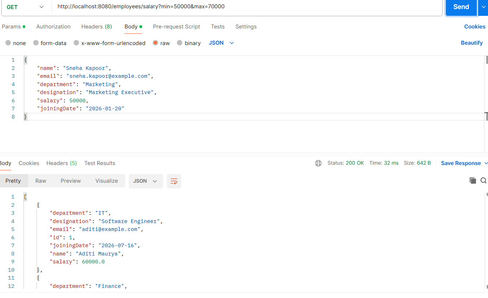
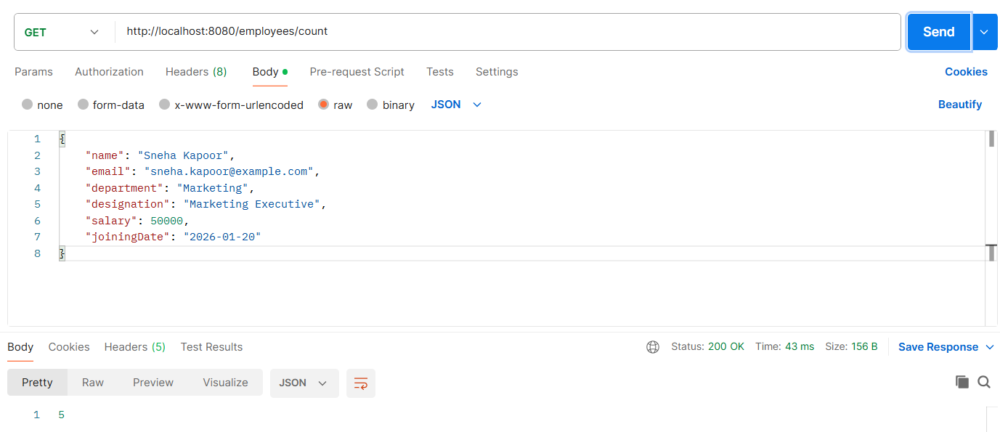
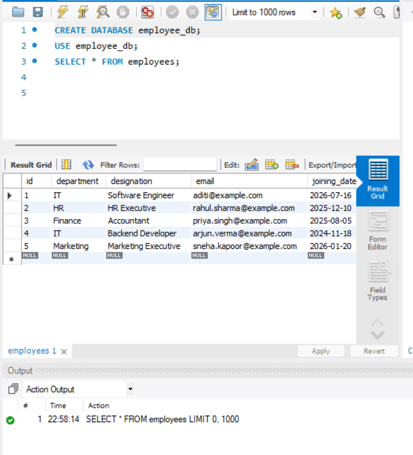

# Employee Management REST API

A RESTful backend application developed using **Spring Boot**, **Spring Data JPA**, and **MySQL** for managing employee records. The application provides APIs to create, retrieve, update, delete, and search employee information while demonstrating layered architecture and database integration.

---

## Features

- Add a new employee
- Retrieve all employees
- Retrieve an employee by ID
- Update employee details
- Delete an employee
- Search employees by department
- Search employees by name
- Search employees by salary range
- Get the total number of employees
- Global exception handling for invalid employee IDs

---

## Tech Stack

- Java 21
- Spring Boot
- Spring Data JPA
- Hibernate
- MySQL
- Maven
- Postman
- Git
- GitHub

---

## Project Architecture

```
Client (Postman)
        │
        ▼
EmployeeController
        │
        ▼
EmployeeService
        │
        ▼
EmployeeRepository
        │
        ▼
Spring Data JPA / Hibernate
        │
        ▼
MySQL Database
```

---

## Project Structure

```text
src
└── main
    ├── java
    │   └── com
    │       └── addie
    │           └── employee_management
    │               ├── controller
    │               ├── entity
    │               ├── exception
    │               ├── repository
    │               ├── service
    │               └── EmployeeManagementApplication.java
    └── resources
        └── application.properties
```

---

## REST API Endpoints

| Method | Endpoint | Description |
| :----: | -------- | ----------- |
| POST | `/employees` | Add a new employee |
| GET | `/employees` | Retrieve all employees |
| GET | `/employees/{id}` | Retrieve employee by ID |
| PUT | `/employees/{id}` | Update employee details |
| DELETE | `/employees/{id}` | Delete employee |
| GET | `/employees/department/{department}` | Search by department |
| GET | `/employees/name/{name}` | Search by name |
| GET | `/employees/salary?min={min}&max={max}` | Search by salary range |
| GET | `/employees/count` | Get total employee count |

---

## Database

- MySQL
- Spring Data JPA
- Hibernate ORM

---

## Testing

The application was tested using **Postman** by verifying all CRUD operations and search endpoints.

---

## Screenshots

### Create Employee


### Get All Employees


### Get Employee by ID


### Search by Department


### Search by Name


### Search by Salary Range


### Employee Count


### MySQL Database


---

## Future Improvements

- Input validation
- Pagination and sorting
- Swagger / OpenAPI documentation
- Spring Security with JWT Authentication

---

## Author

**Aditi Maurya**

GitHub: https://github.com/aditimauryawork-oss
